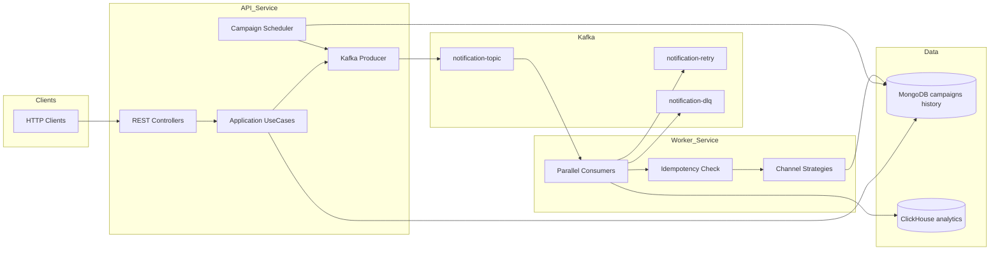

# Kế hoạch thiết kế: Distributed Notification Service (LAB)

## Bối cảnh đề bài

Hệ thống cần: gửi **realtime** và **theo campaign** (lịch + lặp), **đa kênh** (Firebase mock, Email mock, InApp lưu DB), **không mất message** (ý nghĩa thực tế: at-least-once + idempotent xử lý), **retry tối thiểu 1 lần** rồi **DLQ**, lịch sử **MongoDB**, API thống kê **ClickHouse**, tách **API Service** và **Worker Service**, Kafka đúng 3 topic, consumer **đa luồng**, **messageId unique** chống gửi trùng khi retry.

---

## Kiến trúc tổng thể

- **API Service**: nhận HTTP, validate, ghi MongoDB (campaign / metadata cần thiết), publish message lên Kafka; chạy **scheduler nội bộ** (BackgroundService hoặc Quartz.NET) đọc campaign đến hạn và publish giống luồng realtime.
- **Worker Service**: consume Kafka (nhóm consumer, **partition** hợp lý để scale ngang), xử lý song song (ví dụ `ChannelExecutor` + bounded parallelism hoặc nhiều `KafkaConsumer` trong cùng process), áp dụng Strategy cho từng kênh, ghi lịch sử MongoDB, ghi sự kiện analytics vào ClickHouse, điều phối retry/DLQ.

**Ghi chú “không mất message” trong phạm vi LAB**: Kafka + commit offset **sau khi** xử lý thành công (hoặc sau khi đã ghi DLQ/retry một cách an toàn) kết hợp **idempotency** để chấp nhận at-least-once mà người dùng không nhận trùng tác dụng gửi. Có thể bổ sung pattern **Outbox** (ghi document `Outbox` trong Mongo rồi job publish) nếu muốn chặt chẽ hơn khi API crash giữa ghi DB và publish — tùy độ kỹ càng mong muốn.

---

## Cấu trúc solution (Clean Architecture)

Gợi ý một solution .NET 8+ gồm:

| Project | Vai trò |
|---------|--------|
| `Notification.Domain` | Entities, enums (`ChannelType`, `RepeatType`, `CampaignStatus`), value objects, domain events (tùy chọn) |
| `Notification.Application` | Interfaces (repositories, `INotificationChannel`, `IKafkaPublisher`, `IAnalyticsWriter`), DTOs, use cases/commands |
| `Notification.Infrastructure` | MongoDB, Kafka, ClickHouse, implement Strategy (mock Firebase/Email, InApp) |
| `Notification.Api` | ASP.NET Core host, REST, DI, logging, health checks |
| `Notification.Worker` | Worker host, hosted consumers, cấu hình mức song song |

**Shared**: contract message Kafka (JSON hoặc Avro; với LAB, **JSON + schema version** trong header/key là đủ).

---

## Mô hình dữ liệu

### MongoDB

1. **Campaigns** (theo đề)
   - `_id`, `name` (tuỳ chọn), `userIds` hoặc `segmentQuery` (LAB có thể cố định danh sách `userIds`), `channels[]`, `scheduleTime` (UTC), `repeatType` (0–3), `enabled` (bool), `nextRunAt` (tính từ scheduler để query nhanh), `createdAt`, `updatedAt`.
   - Index: `{ enabled: 1, nextRunAt: 1 }`.

2. **NotificationHistory** (mục 3.6)
   - `messageId`, `userId`, `channel`, `status` (success/fail), `errorMessage`, `sentAt`, thêm **`driverCode`** (string, nullable) để khớp API `GET /stats/by-driverCode` — đề có stats theo `driverCode` nhưng bảng 3.6 chưa liệt kê; nên **thống nhất**: mọi API gửi nhận optional `driverCode` và lưu vào history + ClickHouse.

3. **Idempotency** (khuyến nghị cho mục 4.4)
   - Collection `ProcessedNotifications`: key composite **`messageId` + `userId` + `channel`** (unique index), `processedAt`, `outcome`. Worker **check trước khi gửi**; nếu đã success thì ack Kafka và bỏ qua gửi lại.

### ClickHouse (analytics)

- Bảng append-only, ví dụ `notification_events`: `event_time`, `message_id`, `user_id`, `channel`, `success` (UInt8), `driver_code` (LowCardinality String), có thể thêm `campaign_id`.
- Engine: `MergeTree`, partition theo `toYYYYMM(event_time)` hoặc theo ngày tùy khối lượng LAB.
- Worker ghi **sau mỗi lần gửi** (thành công/thất bại) qua client HTTP `Native` hoặc thư viện ClickHouse .NET; batch insert theo buffer nhỏ (vài trăm ms) để giảm round-trip.

---

## Kafka: topics và luồng message

| Topic | Vai trò |
|-------|--------|
| `notification-topic` | Hàng đợi chính: payload gửi (realtime + campaign dequeue) |
| `notification-retry` | Tin cần retry (sau lần gửi fail đầu tiên) |
| `notification-dlq` | Sau retry vẫn fail |

**Payload đề xuất (JSON)** — các trường tối thiểu:

- `schemaVersion`, `messageId` (UUID, unique), `userId`, `channels[]`, `title`, `body` (hoặc template key), `metadata` (object, gồm `driverCode` nếu có), `attempt` (0, 1, …), `source` (realtime | campaign), `campaignId` (nullable), `createdAt`.

**Luồng retry (đáp ứng “retry tối thiểu 1 lần”)**:

1. Consumer đọc từ `notification-topic` (hoặc `notification-retry`), `attempt = 0`.
2. Gửi kênh fail → tăng `attempt`, publish sang **`notification-retry`** với `attempt = 1` (hoặc consumer retry chỉ đọc retry topic).
3. Consumer retry xử lý; nếu fail lại → publish **`notification-dlq`** và ghi history `fail` + log đầy đủ; **commit offset**.

**Tránh vòng lặp vô hạn**: quy tắc cứng `attempt >= 1` sau retry mà vẫn fail → chỉ DLQ.

**Phân vùng (partition)**: số partition ≥ số worker instance × số luồng consumer mục tiêu (ví dụ 6–12 partition cho LAB); key partition có thể là `userId` để giữ thứ tự theo user (tuỳ chọn).

---

## Multi-channel: Strategy Pattern

- Interface `INotificationChannel`: `ChannelType Type`, `Task<SendResult> SendAsync(NotificationMessage ctx, CancellationToken ct)`.
- Đăng ký trong DI: `Dictionary<ChannelType, INotificationChannel>` hoặc factory.
- **FirebaseChannel (mock)**: gọi HTTP giả (`https://httpbin.org/post`) hoặc log + delay ngắn; có cờ cấu hình `ForceFail` cho test Case 3.
- **EmailChannel (mock)**: tương tự (không gửi Gmail thật trừ khi bạn chủ động mở rộng sau LAB).
- **InAppChannel**: ghi document vào MongoDB (ví dụ collection `InAppNotifications`: `userId`, `messageId`, `title`, `body`, `read`, `createdAt`).

Worker lặp theo `channels` trong message; mỗi kênh một lần gửi + một bản ghi history (hoặc một document history với mảng `channels[]` — đề yêu cầu từng dòng theo channel thì **một document per (messageId, userId, channel)** cho rõ).

---

## API surface (API Service)

**Realtime**

- `POST /api/notifications/send` — body: `messageId` (client có thể gửi hoặc server sinh), `userIds[]`, `channels[]`, nội dung, `driverCode?`.
- Validate: ít nhất một user, ít nhất một channel, `messageId` unique (check Mongo hoặc Redis — với LAB có thể unique index trên `NotificationHistory` hoặc collection `MessageRegistry`).

**Campaign**

- `POST /api/campaigns` — tạo, lưu MongoDB, tính `nextRunAt`.
- `PATCH /api/campaigns/{id}/enabled` — bật/tắt.
- `GET /api/campaigns/{id}` — chi tiết (tuỳ chọn).

**Thống kê (đọc ClickHouse — có thể đặt trong API hoặc microservice nhỏ; LAB gộp trong API là đủ)**

- `GET /stats/by-driverCode?driverCode=...&from=&to=`
- `GET /stats/total?from=&to=`
- `GET /stats/by-channel?from=&to=`
- `GET /stats/success-rate?from=&to=`

Mỗi endpoint trả JSON tổng hợp (count, success, fail, rate).

---

## Campaign scheduler (trong API Service)

- **BackgroundService** chạy mỗi 10–30 giây (cấu hình): query Mongo `enabled == true` và `nextRunAt <= UtcNow`.
- Với mỗi campaign: build batch messages (theo `userIds`), **cùng `messageId` hoặc sinh `messageId` per user** — nên **một messageId cho toàn campaign + user** để idempotency rõ: `(campaignRunId, userId, channel)` hoặc `messageId = hash(campaignId + runInstance + userId)`.
- Publish lên `notification-topic`.
- Cập nhật `nextRunAt` theo `repeatType` (0: set `enabled=false` hoặc `nextRunAt=null`; 1: +1 day; 2: +1 week; 3: +1 month — dùng thư viện calendar để tránh lỗi tháng).

**Verify Case 2**: integration test hoặc manual: tạo campaign `scheduleTime = now+1 phút`, chờ, kiể tra Kafka + history.

---

## Hiệu năng và song song (mục 4.3)

- Mục tiêu **5.000 message/phút** (~83/s): một worker với **độ rộng xử lý** 50–100 concurrent in-flight (giới hạn bởi `SemaphoreSlim`) thường đủ nếu mock I/O nhẹ.
- **Multi-thread**: nhiều task consume từ cùng consumer group (mỗi partition một consumer thread trong thư viện `Confluent.Kafka`), hoặc `Parallel.ForEachAsync` trên batch poll — document rõ trong README.
- **Case 4 (10.000 message)**: producer batch + đủ partition; consumer không commit sớm; monitor lag.

---

## Logging (mục 4.5)

- **Serilog** (hoặc built-in) structured logs: `RequestId`/`CorrelationId` middleware, log **request body** (đã mask PII nếu cần), log **Kafka message key/value summary**, log **exception** stack + `attempt`, `messageId`, `userId`, `channel`.

---

## Cấu hình & vận hành local

- **Docker Compose**: Zookeeper/Kafka (hoặc KRaft), MongoDB, ClickHouse; network nội bộ.
- **README**: clone, `docker compose up`, cấu hình `appsettings.Development.json` (bootstrap servers, connection strings), ví dụ `curl`/HTTP file cho API, hướng dẫn chạy load test nhẹ (script hoặc `k6`/wrk).

---

## Kiểm thử theo đề (không code trong bước này — chỉ kế hoạch)

| Case | Cách verify |
|------|-------------|
| 1 Realtime 1000 users | Script gọi API bulk hoặc 1 request 1000 `userId`; đếm history success + (tuỳ chọn) metric consumer |
| 2 Campaign +1 phút | Campaign với `nextRunAt`; sau 1 phút có bản ghi gửi |
| 3 Retry + DLQ | `ForceFail` lần 1 pass lần 2 fail hoặc ngược; quan sát retry topic rồi DLQ + history |
| 4 High load 10k | So sánh số publish vs số history + ClickHouse rows |

---

## Thứ tự triển khai gợi ý (sau khi user duyệt kế hoạch)

1. Solution skeleton + Docker Compose + health checks.  
2. Domain + Kafka contracts + producer từ API.  
3. Worker consume + Strategy mock + Mongo history + idempotency.  
4. Retry/DLQ topics và luồng `attempt`.  
5. ClickHouse schema + ghi events + stats API.  
6. Campaign Mongo + scheduler + repeat.  
7. README + test performance thủ công/script.

---

## Rủi ro / quyết định cần lưu ý

- **driverCode**: bổ sung vào API gửi và payload Kafka để stats API có dữ liệu — tránh lệch với đề.  
- **Retry timing**: publish ngay sang `notification-retry` có thể retry quá nhanh; có thể thêm `notBefore` (epoch) trong payload và consumer retry chờ — không bắt buộc đề nhưng giảm thundering herd.  
- **Bulk 1000 users**: một request có thể tách thành N message Kafka (1 message = 1 user) để scale và idempotency đơn giản hơn.
